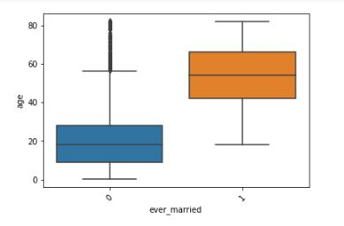
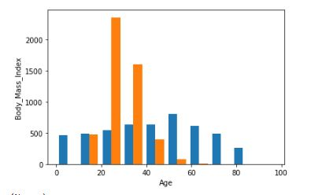
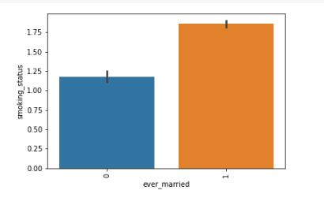

# Stroke Prediction Analysis
### Business Problem
   Analyzed data to determine how likely an individual is to experience a stroke while providing answers to key questions that can lead to healthier lifestyles
   
### The Data
   The Data source is a csv flat file from World Health Organization, the Data is titled Stroke Prediction which consist of 12 columns and 5110 rows. The dataset consist of 3 different datatypes which are objects, floats and an integer. Both Numeric and Categorical data.

### The Method
   Import Packages • Load Data • Explore Data • Perform a Validation Split • Preprocess the data • Analyze the data for correlating features • Create & fit 2 separate Models • Compare and Evaluate the score for the best choice • Apply Feature engineering (PCA) for efficient runtime.

### Exploratory Visualization
#### The Boxplot
   In the Boxplot below, the average mean of age of unmarried patient is under 20 while the average mean age of married patient in our dataset is 55. This box plot shows the age range among potential stroke patients based on marital status.

#### The Histogram
   In the Histogram below, it shows patient at age 24 and under, and those above the age of 75 have a lower Body Mass Index. Teenagers and young adult are a lot mobile and tend to engage in more outdoor activities than any other age groups which contributes to a lower Body Mass Index. Those in of age range of 75 and up tend to shrink down in size the older they get which also contributes to a lower Body Mass Index. The histogram shows other age groups with a higher Body Mass Index. Obesity and Excess weight does increase the risk of severe illness and other health problems.
   

#### The Barplot
   In the Bar-plot above, we see that marital status correlates with smoking status. We also see that married patients have a higher smoking rate than unmarried patients. Marriage can cause lots of stress that turns a none-smoker into a smoker.
   

### Summary of the Model & the Metrics
   The 2 models were created to predict the outcome of stroke, the first model is a DecisionTreeClassifier and the 2nd model is KNeighborsClassifier. Evaluating both models using GridSearch CV and Classification Report, we end up with an identical test score for both first and second model. Model 2 was chosen for production because it has just the concise number of hyper parameter needed for tuning which also makes KNeighborsClassifier an ideal model to use when solving a classification problem such as the stroke prediction.

##### GridSearch CV test score:
First Model = 0.9470684039087948, 2nd Model = 0.9470684039087948 
##### Classification Report test score:
First Model = 0.95, 2nd Model = 0.95
